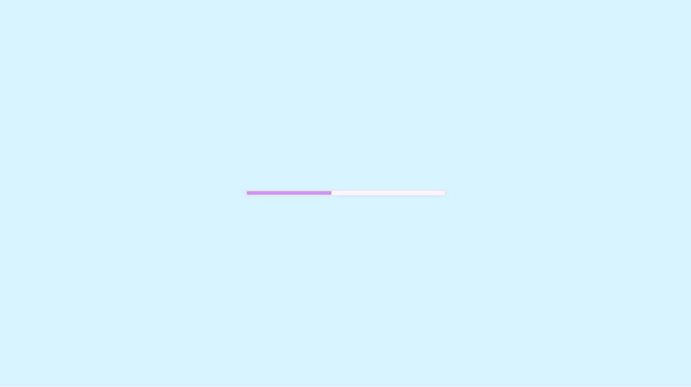
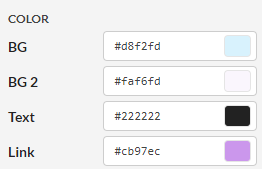

# Better HTML export template with customisable background color
I wanted to create a better HTML export template with customisable load bar color for my game [Emilien in Paris](https://ilvegames.itch.io/emilien-in-paris).  

  

You can customise the line between 9 and 12 to change the color. If you use Itch.io, you can match some colors with your theme to have a good integration.  
- --background-color: BG
- --progress-bar-background: BG2
- --progress-bar-background: BG2 but a darker
- --progress-line-background: Link

Example with Emilien in Paris:  

Then, [replace your HTML Shell in Godot](https://docs.godotengine.org/en/stable/tutorials/platform/web/customizing_html5_shell.html#setup)

**Tested for Godot 4.1 and 4.2**